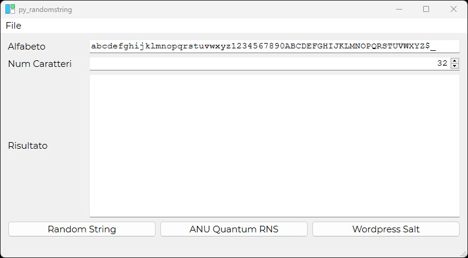

# PY_randomstring
applicazione per generare una stringa casuale



## PIP
```
pip install PyQt6
```

## Creation of virtual environments
### Linux Mac
Note generali su come installa un virtual environment su linux/mac
```
pip install virtualenv
/home/utentelocale/.local/bin/virtualenv py_bin_env
```
Per attivare l'ambiente
```
source py_bin_env/bin/activate
```
Appena attivato l'ambiente aggiornare pip
```
python.exe -m pip install --upgrade pip
```
Per uscire dall'ambiente
```
deactivate
```
### Windows
Note generali su come installa un virtual environment su linux/mac
```
python -m venv .\py_bin_env
```
Per attivare l'ambiente
```
.\py_bin_env\Scripts\activate.bat
```
Appena attivato l'ambiente aggiornare pip
```
python.exe -m pip install --upgrade pip
```
Per uscire dall'ambiente
```
deactivate.bat
```

## Lanciare l'applicazione
```
python main.py
```
Per lanciare la vecchia pplicazione basata su tk lanciare
```
python old.py
```

## Note relative ai file bat
Per lanciare l'applicazione da un file .bat
```
cd nomartella
START /MIN cmd /c python main.py
```

## Note relative per creare un file standonline
Utilizzo base di pyinstallert
```
pip install -U pyinstaller
pyinstaller.exe --onefile --windowed --icon=icona.ico --add-data="icona.ico:." main.py
```
